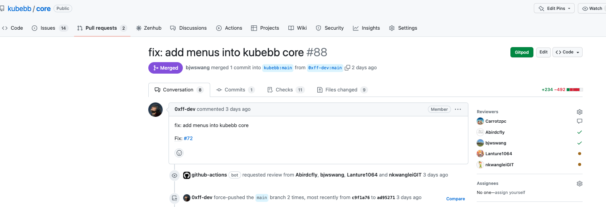

**欢迎来到 KubeBB!**

我们鼓励您通过报告问题、改进文档、修复错误或添加新功能来为社区做贡献!

目前我们的行为准则遵循 CNCF 的[行为准则](https://github.com/cncf/foundation/blob/main/code-of-conduct.md)，其中详细说明了您作为 KubeBB 社区的一员应如何行事。

## 项目组成

KubeBB 由若干个项目组成：

- [kubebb/core](https://github.com/kubebb/core): 基于 kubernetes operator 框架，实现的组件生命周期管理功能
- [kubebb/components](https://github.com/kubebb/components): 基于KubeBB组件开发规范，管理认证后的组件、仓库和示例。

## 报告问题

在试用或体验 KubeBB 相关组件时，你可能对这个项目有一些反馈。那么，请随时打开一个问题。包括但不限于：

- 报告 bug
- 请求新特性
- 性能问题
- 新特性草案
- 新特性设计
- 需要帮助
- 文档改进
- 测试改进
- 任何其他关于这些项目的问题
- 等等

另外我们必须提醒您，在提交新问题时，请记住从你的 issue 中删除**敏感数据**。

*敏感数据可能是密码、密钥、网络位置、业务数据等。*

## 代码和文档贡献

我们鼓励每一个让 KubeBB 变得更好的行动。在 GitHub 上，KubeBB 的每一项改进都可以通过 PR（pull request 的缩写）来实现。

- 如果你发现一个 typo，尝试修复它！
- 如果你发现一个 bug，尝试修复它！
- 如果你发现一些重复代码，尝试删除它！
- 如果你发现丢失了一些测试用例，尝试添加它们！
- 如果你能新增一个特性，请不要犹豫！
- 如果你发现一些代码不够清晰，请添加一些注释！
- 如果你发现一些代码 ugly，尝试重构它们！
- 如果你能帮助更新文档内容，那再好不过了！
- 如果你发现文档有一些错误，请尝试修改它！
- 等等

### 创建PR

提出 PR，我们假设你已经注册了一个 GitHub ID。然后你可以按照以下步骤完成准备工作：

1. **Fork** 你想工作的项目。你只需要点击项目主页面左上角的 Fork 按钮即可。
   在仓库主页面的左手边。然后你就可以在你的 GitHub 用户名中看到你的仓库了。
2. **Clone** 你自己的仓库到本地来开发。使用 `git clone https://github.com/<your-username>/<your-project>.git` 来克隆代码仓库到你的本地机器。然后你可以创建新的分支来完成你想做的改动。
3. **设置远程上游** 上游设置为 `https://github.com/kubebb/<project>.git`
   例如：

   ```bash
   git remote add upstream https://github.com/kubebb/core.git
   git remote set-url --push upstream no-pushing
   ```

   增加 upstream ，我们可以轻松地将本地分支与上游分支同步。
4. **创建一个分支** 添加新特性或者修复问题。
   更新本地工作目录：

   ```bash
   cd <project>
   git fetch upstream
   git checkout main
   git rebase upstream/main
   ```

   创建新的分支：

   ```bash
   git checkout -b <new-branch>
   ```

   在新的分支改动后可以构建和测试你的代码。

### PR规范

通过创建 PR 是对 KubeBB 项目的文件进行修改的唯一途径.

```bash
git commit --signoff -m "description of this PR"
```

为了帮助 reviewer 更好地理解你创建的 PR 的目的，PR描述需符合如下规范:

```bash
<type>: <description>

[optional body]
```

其中，`type`  种类包括:

- `feat` - 引入了新功能
- `fix` - 修复了一个错误
- `chore` - 与修复或功能无关的更改，不修改源代码或测试文件（例如更新依赖项）
- `refactor` - 重构的代码，既不修复错误也不添加功能
- `docs` - 更新文档，如README或其他markdown文件
- `style` - 不影响代码含义的更改，通常与代码格式相关，如空格、缺少分号等。
- `test` - 包括新的测试或更正之前的测试
- `perf` - 性能改进
- `ci` - 与持续集成相关
- `build` - 影响构建系统或外部依赖项的更改
- `revert` - 撤销先前的提交

如果PR为对应解决某个 `issue` ，必须在PR出，添加 `Fix: #1 #2` ，如下图:



### 代码规范

- Go语言规范，参考[uber-go/guide](https://github.com/uber-go/guide/blob/master/style.md)

## 参与帮助任何事情

我们选择 GitHub 作为 KubeBB 合作的主要场所。所以 KubeBB 的最新更新总是在这里。尽管通过 PR 的贡献是一种明确的帮助方式，我们仍然呼吁任何其他方式:

- 在 issue 中回复其他人的问题
- 帮助解决其他人的问题
- 帮助 review 其他人的 PR
- 参与讨论
- 写技术博客
- 等等

## 加入社区

如果您想成为 KubeBB GitHub 组织的成员，请参考下面的介绍：

### 加入 KubeBB Github 组织

在要求加入社区之前，我们要求你先做少量的贡献，以证明你有继续为 KubeBB 贡献的意愿。

- **注意** 任何人都可以为 KubeBB 做出贡献，加入 KubeBB Github 组织并不是一个强制性的步骤。

有很多方法可以为 KubeBB 做出贡献:

- 提交 PR
- 报告错误或提供反馈
- 回答 GitHub 上的问题

#### 提出您的申请

- 在 KubeBB 仓库中创建一个 issue，并尽可能罗列您所做的全部工作。
- 请 AT 2 个现有的 reviewer 以获取同意。
- 请求被批准后，管理员将向你发出邀请。
  - 这是一个手动过程，通常每周运行几次。
  - 如果一个星期过去了，没有收到邀请，请通过邮件或者钉钉联系我们。
