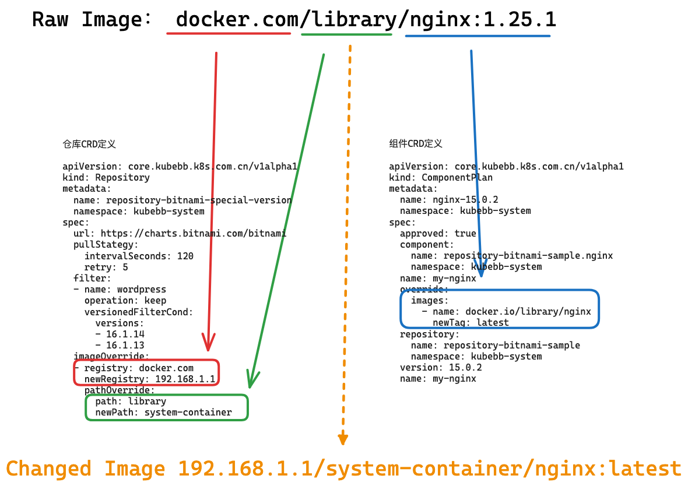

# “镜像替换”功能的完整说明

## 介绍

镜像替换指的是使用指定的镜像名称替换 helm chart 包中的镜像从而正常安装的功能。常用于 kubernetes 离线环境，无法访问原始镜像仓库时使用。

这时我们通常会做 2 件事：首先找一个可以访问原始镜像仓库的环境下载镜像，并将镜像按一定的规则上传到自己的镜像仓库中，然后在安装时修改镜像地址。本功能就是为了方便的完成第 2 步而设计的。

有如下优势：

1. 无需更改 helm chart 包。
2. 按需更改，颗粒度小。
3. 分为仓库组件替换和组件替换，可分别配置，互相解耦，互不影响。



以上图为例，helm chart 包中的镜像为 `docker.com/library/nginx:1.25.1`，我们实际安装 helm chart 包时，需要的镜像地址为 `192.168.1.1/system-container/nginx:latest`，镜像替换功能确保了我们安装时使用后一个地址进行安装。

镜像替换功能实际是通过 [Helm:post-rendering](https://helm.sh/docs/topics/advanced/#post-rendering) 技术实现的。

## 参数说明

### Docker 镜像格式说明

我们仍然以 `docker.com/library/nginx:1.25.1` 为例来说明：

根据 [docker 官方文档](https://docs.docker.com/engine/reference/commandline/tag/#description)基本格式为：`[HOST[:PORT_NUMBER]/]PATH:TAG`，其中：

- HOST: 可选，主机名指定映像所在的位置。主机名必须符合标准 DNS 规则，但不得包含下划线。如果未指定主机名，则 Docker 默认使用位于 `registry-1.docker.io` 的公共镜像仓库。
- PORT_NUMBER: 如果存在主机名，则可以选择在其后面跟随格式为 `:8080` 的镜像仓库端口号。
- PATH: 路径由斜杠分隔的部分组成。每个部分可以包含小写字母、数字和分隔符。分隔符定义为一个句点、一个或两个下划线、或者一个或多个连字符。部分不能以分隔符开始或结束。虽然 [OCI 规范](https://github.com/opencontainers/distribution-spec)支持两个以上斜杠分隔的部分，但大多数镜像仓库仅支持两个斜杠分隔的部分。对于 Docker 的公共镜像仓库，路径格式如下：
  - `[NAMESPACE/]REPOSITORY`: 第一个可选部分通常是用户或组织的命名空间。第二个强制部分是存储库名称。当命名空间不存在时，Docker 使用 `library` 作为默认命名空间。
- 在镜像名称之后，可选的 `TAG` 是一个自定义的、人类可读的清单标识符，通常是镜像的特定版本或变体。该标签必须是有效的 ASCII，并且可以包含小写和大写字母、数字、下划线、句点和连字符。它不能以句点或连字符开头，且不得超过 128 个字符。如果未指定标记，则 Docker 命令默认使用 `latest`。

### 镜像替换 配置说明

#### 仓库部分

一个仓库的例子如下：

```yaml
apiVersion: core.kubebb.k8s.com.cn/v1alpha1
kind: Repository
metadata:
  name: repository-bitnami-special-version
  namespace: kubebb-system
spec:
  # 省略其他部分
  imageOverride:
  - registry: docker.io
    newRegistry: 192.168.1.1
    pathOverride:
      path: library
      newPath: system-container
```

每项参数的具体说明：

`spec.imageOverride`  非必需，该字段是数组，定义了一系列仓库级别的镜像覆盖策略。

每一项内容包括：

- `spec.imageOverride[].registry` 该镜像仓库域名地址，可以包含端口，例如：`docker.io`，`192.168.1.1:5000`
- `spec.imageOverride[].newRegistry` 要将 `registry` 替换后的镜像仓库域名地址，可以包含端口。
- `spec.imageOverride[].pathOverride` 非必需，数组。
  - `spec.imageOverride[].pathOverride.path` 旧的镜像仓库路径，比如镜像地址 `docker.io/library/nginx:latest` 中的 path 为 `library`
  - `spec.imageOverride[].pathOverride.newPath` 要将 `path` 替换后的镜像仓库新路径，可以为空。

#### 组件安装部分

下面是一个 ComponentPlan 示例：

```yaml
apiVersion: core.kubebb.k8s.com.cn/v1alpha1
kind: ComponentPlan
metadata:
  name: nginx-15.0.2
  namespace: kubebb-system
spec:
  # 省略其他部分
  override:
    images:
      - name: docker.io/bitnami/nginx
        newTag: latest
```

每项参数的具体说明：

`spec.override.images` 数组。类似 [`kustomize` 的镜像自定义参数](https://kubectl.docs.kubernetes.io/references/kustomize/builtins/#_imagetagtransformer_)

- `spec.override.images[].name`

  原始镜像名称，`tag` 可选，如果包含 `tag`，则匹配精确到 `tag` 一致才替换，比如，如果该项为 `docker.io/bitnami/nginx:v1`，那么只匹配 tag 为 `v1` 的 nginx 镜像，如果有 `docker.io/bitnami/nginx:v2` 不会被替换。
- `spec.override.images[].newName`

  替代原始镜像名称的名称
- `spec.override.images[].newTag`

  替代原始 `tag` 的新 `tag` 名称
- `spec.override.images[].digest`

  替代原始 `tag` 的新 `digest`，如果 `digest` 有值，会忽略 `newTag` 的值。

## 具体案例

### 批量复制仓库

假设我们希望将 helm chart 包 [bitnami nginx chart version:15.0.2](https://artifacthub.io/packages/helm/bitnami/nginx/15.0.2) 部署到离线 kubernetes 环境，这里涉及到的镜像为：

| 原始镜像                                               | 用途                              | 必选 |
| ------------------------------------------------------ | --------------------------------- | ---- |
| docker.io/bitnami/nginx:1.25.1-debian-11-r0            | nginx deployment 使用             | 必选 |
| docker.io/bitnami/git:2.41.0-debian-11-r4              | nginx deployment 导入配置使用     | 可选 |
| docker.io/bitnami/nginx-exporter：0.11.0-debian-11-r91 | nginx deployment 暴露 metric 使用 | 可选 |

假设我们将 `docker.io/bitnami/` 镜像仓库批量复制到了我们自己的镜像仓库 `192.168.1.1:5000` 中，那么上面镜像的地址将变更如下：

| 原始镜像                                              | 本地镜像                                             |
| ----------------------------------------------------- | ---------------------------------------------------- |
| docker.io/bitnami/nginx:1.25.1-debian-11-r0           | 192.168.1.1:5000/nginx:1.25.1-debian-11-r0           |
| docker.io/bitnami/git:2.41.0-debian-11-r4             | 192.168.1.1:5000/git:2.41.0-debian-11-r4             |
| docker.io/bitnami/nginx-exporter:0.11.0-debian-11-r91 | 192.168.1.1:5000/nginx-exporter:0.11.0-debian-11-r91 |

那么，我们只需要在仓库中修改配置如下即可

```yaml
apiVersion: core.kubebb.k8s.com.cn/v1alpha1
kind: Repository
metadata:
  name: repository-bitnami-special-version
  namespace: kubebb-system
spec:
  # 省略其他部分
  imageOverride:
  - registry: docker.io
    newRegistry: 192.168.1.1:5000
    pathOverride:
      path: bitnami
      newPath: ""
```

### 使用自定义镜像

假设我们希望将 helm chart 包 [bitnami nginx chart version:15.0.2](https://artifacthub.io/packages/helm/bitnami/nginx/15.0.2) 部署到可访问 docker.io 的 kubernetes 环境中，这里涉及到的镜像为：

| 原始镜像                                               | 用途                              | 必选 |
| ------------------------------------------------------ | --------------------------------- | ---- |
| docker.io/bitnami/nginx:1.25.1-debian-11-r0            | nginx deployment 使用             | 必选 |
| docker.io/bitnami/git:2.41.0-debian-11-r4              | nginx deployment 导入配置使用     | 可选 |
| docker.io/bitnami/nginx-exporter：0.11.0-debian-11-r91 | nginx deployment 暴露 metric 使用 | 可选 |

假设我们希望使用自己编译的 nginx 镜像 `192.168.1.1:5000/tmp/nginx:2023`，那么上面镜像的地址变更如下：

| 原始镜像                                              | 本地镜像                                              |
| ----------------------------------------------------- | ----------------------------------------------------- |
| docker.io/bitnami/nginx:1.25.1-debian-11-r0           | 192.168.1.1:5000/tmp/nginx:2023                       |
| docker.io/bitnami/git:2.41.0-debian-11-r4             | docker.io/bitnami/git:2.41.0-debian-11-r4             |
| docker.io/bitnami/nginx-exporter:0.11.0-debian-11-r91 | docker.io/bitnami/nginx-exporter:0.11.0-debian-11-r91 |

那么，我们只需要在安装时的 ComponentPlan 中配置如下：

```yaml
apiVersion: core.kubebb.k8s.com.cn/v1alpha1
kind: ComponentPlan
metadata:
  name: nginx-15.0.2
  namespace: kubebb-system
spec:
  # 省略其他部分
  override:
    images:
      - name: docker.io/bitnami/nginx
        newName: 192.168.1.1:5000/tmp/nginx 
        newTag: "2023"
```

### 批量复制仓库，且使用自定义镜像

假设我们希望将 helm chart 包 [bitnami nginx chart version:15.0.2](https://artifacthub.io/packages/helm/bitnami/nginx/15.0.2) 部署到离线 kubernetes 环境，这里涉及到的镜像为：

| 原始镜像                                               | 用途                              | 必选 |
| ------------------------------------------------------ | --------------------------------- | ---- |
| docker.io/bitnami/nginx:1.25.1-debian-11-r0            | nginx deployment 使用             | 必选 |
| docker.io/bitnami/git:2.41.0-debian-11-r4              | nginx deployment 导入配置使用     | 可选 |
| docker.io/bitnami/nginx-exporter：0.11.0-debian-11-r91 | nginx deployment 暴露 metric 使用 | 可选 |

假设我们将 `docker.io/bitnami/` 镜像仓库批量复制到了我们自己的镜像仓库 `192.168.1.1:5000/bitnami-mirror/` 中，并且我们希望使用自己编译的 nginx 镜像 `192.168.1.1:5000/tmp/nginx:2023`，那么上面镜像的地址变更如下：

| 原始镜像                                               | 本地镜像                                                             |
| ------------------------------------------------------ | -------------------------------------------------------------------- |
| docker.io/bitnami/nginx:1.25.1-debian-11-r0            | 192.168.1.1:5000/tmp/nginx:2023                                      |
| docker.io/bitnami/git:2.41.0-debian-11-r4              | 192.168.1.1:5000/bitnami-mirror/git:2.41.0-debian-11-r4              |
| docker.io/bitnami/nginx-exporter：0.11.0-debian-11-r91 | 192.168.1.1:5000/bitnami-mirror/nginx-exporter：0.11.0-debian-11-r91 |

那么，我们首先需要在仓库中配置如下

```yaml
apiVersion: core.kubebb.k8s.com.cn/v1alpha1
kind: Repository
metadata:
  name: repository-bitnami-special-version
  namespace: kubebb-system
spec:
  # 省略其他部分
  imageOverride:
  - registry: docker.io
    newRegistry: 192.168.1.1:5000
    pathOverride:
      path: bitnami
      newPath: bitnami-mirror
```

然后在在安装时的 ComponentPlan 中配置如下：

```yaml
apiVersion: core.kubebb.k8s.com.cn/v1alpha1
kind: ComponentPlan
metadata:
  name: nginx-15.0.2
  namespace: kubebb-system
spec:
  # 省略其他部分
  override:
    images:
      - name: docker.io/bitnami/nginx
        newName: 192.168.1.1:5000/tmp/nginx 
        newTag: "2023"
```

## 对比

### 和 helm 安装命令中的 `--set image=xxx` 对比

很多 helm chart 包在 `values.yaml` 中提供了变量来存储镜像的地址。

一些设计的更加精巧的 helm chart 包还详细的区分了镜像的 registry ，repository 和 tag。（比如上面提到的 helm chart 包 [bitnami nginx chart version:15.0.2](https://artifacthub.io/packages/helm/bitnami/nginx/15.0.2) 提供了 `image.registry`(默认为 `docker.io`) `image.repository`(默认为 `bitnami/nginx`) `image.tag`(默认为 `1.25.1-debian-11-r0`) 和 `image.digest`(默认为空) 四个变量）

使用这些变量来修改镜像地址是可行的。

但是不是所有的 helm chart 包都遵循了这些实践，另一方面，helm chart 包使用哪个变量来替换镜像并没有统一的规范。

使用镜像替换功能可以无视上述问题，实现统一镜像替换。

另一个场景是，当我们复制镜像仓库时（比如修改 harbor 的对外地址，或者将镜像离线安装到另一个环境），如果使用 helm 的安装命令 `--set image=xxx` 来安装，我们需要修改每一个命令为新的仓库地址。而使用镜像替换功能，我们只需要修改仓库的配置，组件的配置无需修改。
