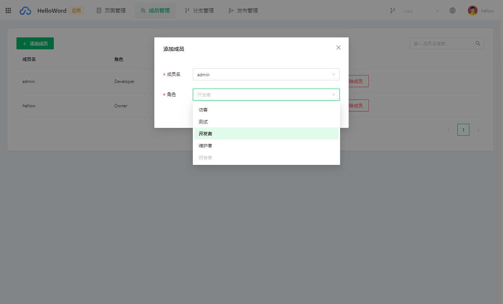
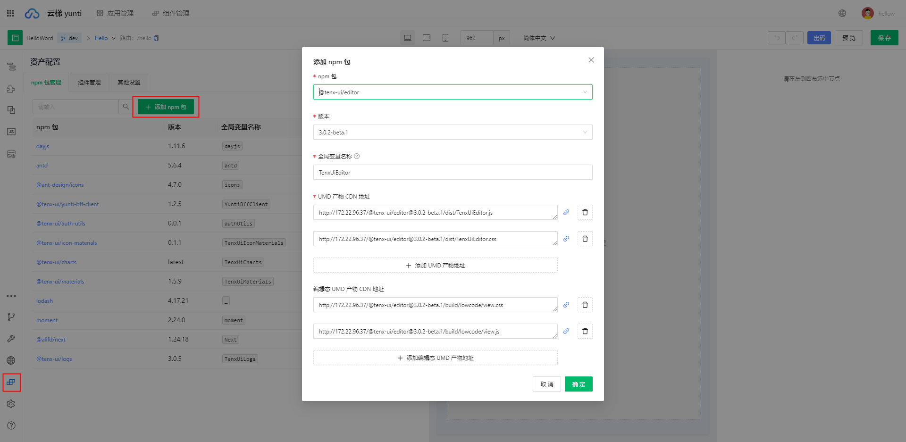
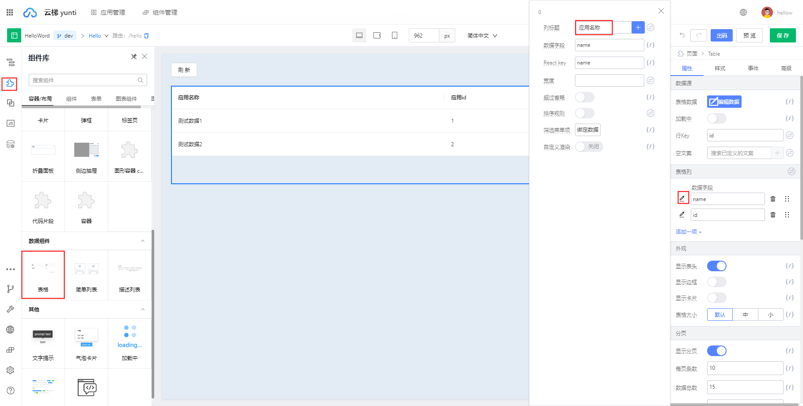
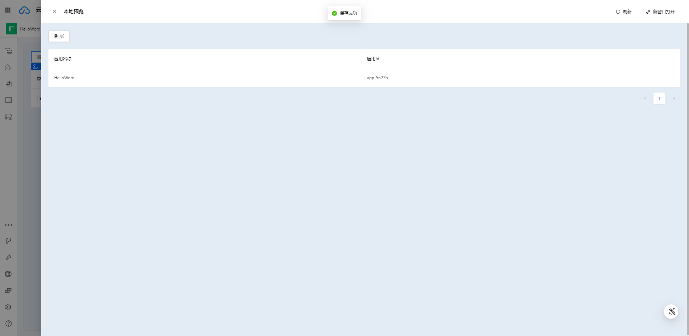

# 前端层基于低码 Kit 的开发

本章节介绍如何使用低码 Kit 开发前端应用。

## 1. 新增应用

首先我们需要在云梯工作台【应用管理】-【新增应用】下创建一个应用，如果您已有可用的应用则可以跳过本步，如下图所示，我们创建一个名为 `Hello World` 的空白应用：


## 2. 添加成员

:::tip

1. 系统管理员拥有所有权限
2. 全局用户权限：所有用户都可以随意创建应用和组件，只能看到自己有权限的应用或组件
3. 应用&组件内成员权限

|-| 拥有者 | 维护者  | 开发者 | 测试 | 访客 |
|:--------| :---------:|--------:|--------:|--------:|--------:|
| 应用 - 页面管理 | 所有权限 | 所有权限 | 所有权限 | 查看权限 | 查看权限 |
| 应用 - 发布管理 | 所有权限 | 所有权限 | 查看权限 | 查看权限 | x |
| 应用 - 成员管理 | 所有权限 | 所有权限 | x | x | x |
| 应用 - 分支管理 | 所有权限 | 所有权限 | 所有权限 | x | x |
| 组件 - 版本管理 | 所有权限 | 所有权限 | 查看及设计权限 | 查看权限 | 查看权限 |
| 组件 - 成员管理 | 所有权限 | 所有权限 | x | x | x |
| 组件 - 分支管理 | 所有权限 | 所有权限 | 所有权限 | x | x |

:::

如果您没有相关应用权限，可以联系应用拥有者在【成员管理】-【添加成员】添加开发者权限，如果您已有开发者权限可以跳过本步：



## 3. 创建分支
  
:::tip

  1. 默认主分支：创建应用时，会默认基于 main 分支创建一个应用的默认分支 <应用 ID>/main
  2. 发版分支：以 'release-' 开头的分支比较特殊，仅 Owner 及 Maintainer 可创建编辑，不过所有应用成员均拥有读取权限，发版分支的命名形式为：<应用 ID>/release-<版本>
  3. 开发分支：用户各自创建的非发版分支都属于开发分支，这些分支仅创建人可见，当开完完成一个功能后，可以将开发分支的更改提交 merge 到发版分支，开发分支的命名形式为：<应用 ID>/<用户 ID>/分支展示名
:::

接下来我们需要在云梯工作台【分支管理】-【创建分支】创建一个开发分支，如果您已有相关分支可以跳过本步，如下图所示，我们创建一个名为 `dev` 的分支：
:::info
可在【页面管理】- 点击右上角切换到 `dev` 分支
:::


## 4. 新增页面

点击【页面管理】，点击【右上角选择分支】切换到 `dev` 分支，如图所示，

接下来我们需要创建一个页面来实现 `Hello World` 的功能，如下所示，当前我们还没有页面模板（已有的页面），可以不选择：


我们可以通过【右上角按钮】进行编辑页面信息和删除页面操作，如下图所示：


## 5. 设计页面

 点击【选择页面】-【设计页面】 直接进入页面设计器：

 

### 5.1 添加资产
  
  首先我们需要添加设计页面所需要的资产，资产分为组件和非组件两种类型，如组件资产包、bff 接口的 npm 包。此处我们已有内置的组件资产包，可以先跳过。

:::tip

  1. 内置前端资产包如下：
  
  |包名| 功能 |类型  |
  |:--------| :---------:|--------:|
  |@tenx-ui/materials| 基于 antd 的组件资产包 | npm 组件 |
  |@tenx-ui/charts| 基于 bizcharts 的图表组件资产包 | npm 图标组件 |
  |@tenx-ui/icon-materials|  基于  @ant-design/icons, @tenx-ui/icon 的图标组件资产包 | npm 图标组件 |

  2. 手动添加 npm 包时会通过解析 package 文件中的 yunti 字段，判断当前 npm 包类型并添加到组件管理中。

  package.json 示例：

  ```
   "yunti": {
    "umd": { // UMD 产物 CDN 地址
      "library": "TenxUiMaterials",
      "entry": [
        "/dist/TenxUiMaterials.js",
        "/dist/TenxUiMaterials.css"
      ],
      "externals": {  // 依赖的外部包（自动添加）
        "antd": ">=5.4.0",
        "dayjs": ">=1.8.27",
        "@ant-design/icons": ">=4.7.0",
        "react": ">=16.9.0",
        "lodash": ">=4.17.21"
      }
    },
    "lowCode": { // 编辑态 UMD 产物 CDN 地址
      "meta": "/build/lowcode/meta.js",
      "editEntry": [
        "/build/lowcode/view.css",
        "/build/lowcode/view.js"
      ]
    }
  }
  ```
  
  添加 npm 资产包操作如下图所示：
  
:::

### 5.2 全局设置
  
  【全局设置面板】主要包括 `antd` 全局样式设置，应用版本设置 等，如下图所示：

  

### 5.3 拖入组件并配置属性

  我们的 `Hello World` 示例非常简单，总共包含两个组件，开发者可以从【组件库面板】中将组件先拖入画布，然后通过右侧【设置器面板】配置相关属性：

- **刷新按钮** - 用于刷新页面数据，我们将组件的`图标`属性设置为关闭，为了美观我们在【样式面板】中设置下边距：`20px`；
- **表格** - 用于展示列表数据，我们将表格的`列标题`属性设置为 "应用名称"、 应用id，如下图所示；

 
  
### 5.4 添加数据源&绑定数据

:::tip
  添加数据源有两种方式：

  1. 通过数据源面板填加，内置了 `axios` 和 `jsonp` 两种类型；
  2. 通过资产配置的方式引入 `bff sdk`（此方式基于 `swr`）；
:::

  从这一步我们要开始实现逻辑部分了，我们现在用第二种方式

  1. 首先点击进入【资产配置】面板，添加 `sdk` 资产包 `@tenx-ui/yunti-bff-client`， 如下图所示:

  

  2. 点击进入【全局上下文管理】面板，添加全局函数 `bff` 来引用刚刚添加的 sdk 资产包 `@tenx-ui/yunti-bff-client` 如下图所示:

   

  3. 绑定 sdk 中的请求方法：

     - 方式一：可以通过 `this.utils.bff.getXXX` 在 【源码面板】中来调用 `sdk` 中的请求方法

     - 方式二：【属性设置面板】-【调用函数】（目前仅支持解析全局函数 `bff` 所绑定的 npm 资产的方法 ），如下图所示：

     

  4. 最后一步

- 我们需要将接口返回的数据变量 `this.props.useGetCurrentUserApps?.data?.currentUser?.apps` 绑定到**表格**组件的`表格数据`属性上进行展示；

- 将变量 `this.props.useGetCurrentUserApps?.loading` 绑定到**表格**组件的`加载中` 属性上进行展示，
  
- 将变量 `this.props.useGetCurrentUserApps?.data?.currentUser?.apps?.length`  绑定到**表格**组件的`数据总数`属性上进行展示

    如下图所示：

  

### 5.5 添加变量/方法

:::tip
  添加变量/方法根据作用域不同有两种：

  1. 应用级别：所有页面都可以使用，在【全局上下文管理】处添加；
  2. 页面级别：只有当前页面可以使用，在【源码面板】内添加；
:::

  打开【源码面板】，创建一个 `refresh` 方法，用来刷新数据，如下所示：

  ```
  refresh() {
    this.props.useGetCurrentUserApps.mutate()
  }
  ```

  

### 5.6 绑定事件

给按钮绑定点击事件，如下图所示，打开【事件绑定面板】，选择源码面板中已经创建的 `refresh` 方法，如果不选择，点击确定后我们会根据低码设置的事件模板自动打开【源码面板】并生成一个 JS 函数：


### 5.7 保存&预览

到目前为止，我们的 `Hello Word` 示例就已经开发完成了，用户可以点击设计器右上角的【保存】/【预览】 按钮进行 保存/预览, 预览操作默认会保存数据：



### 5.8 git 提交

开发完成后我们可以通过 【git 提交面板】来提交所有修改：


### 5.9 发布&出码

最后可以通过【应用发布】模块来发布应用，详见 [发布一个 Hello World 组件](./develop-hello-world.md) ，或者点击【出码】按钮进行 `ProCode` 出码，如下图所示


