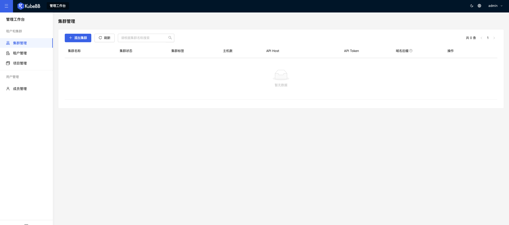

# 总览

KubeBB(Kubernetes Building Blocks)是一种由[**内核**](./core/intro)驱动的组件生命周期管理平台，集成开箱即用的[**云原生底座**](./building-base/intro)和[**低码组件开发**](./lowcode-development/intro)能力,整合实现[**云原生三层组件模式**](./lowcode-development/development_pattern)。

Kubebb提供三个**套件**：

- [**内核Kit**](./core/intro)

提供**声明式的组件生命周期管理和组件市场**,并通过**Tekton流水线**强化低代码平台组件与底座服务的集成。

- [**底座Kit**](./building-base/intro)

提供开箱即用的云原生服务门户，包括**用户、OIDC认证、权限、审计、租户管理、门户服务等基础组件以及证书管理、Nignx Ingress**等集群组件。

- [**低码Kit**](./lowcode-development/intro)

依托[**Low-Code Engine**](https://lowcode-engine.cn/index)和具有Git特性的关系数据库[**Dolt**](https://www.dolthub.com/)打造，并借助底座门户的**菜单和路由资源**和内核套件的**组件管理**能力,实现组件开发、测试到上线的全链路能力。

三个核心套件之间的关系可以类比一下**操作系统**:

- **Kubernetes** ~ **操作系统内核**
- **Core** ~ **软件安装器**
- **底座Kit** ~ **操作系统的系统软件，如GUI、用户系统、网络等**
- **低码组件开发Kit** ~ **操作系统软件开发工具**

## 内核Kit

**内核Kit**的是现阶段我们重点关注并研发的[**项目**](https://github.com/kubebb/core),完全遵循开源项目管理规范。现阶段我们的目标:

### 1. 声明式的组件全生命周期管理

基于[**Operator Pattern**](https://kubernetes.io/docs/concepts/extend-kubernetes/operator/)开发,实现声明式的组件全生命周期管理。

#### 提供四个核心的CRD实现:

- [**Repository组件仓库**](./core/concepts/repository)

定义了组件仓库的访问信息、轮询策略和过滤选项，从而实现周期性地向仓库服务获取最新的组件列表信息。

- [**Component组件**](./core/concepts/component)

记录组件的基础描述、版本列表、是否废弃等信息

- [**ComponentPlan组件部署**](./core/concepts/componentplan)

定义组件安装部署的手动批准、组件引用、版本设置、类helm的配置覆盖策略，从而实现组件的可追踪部署、升级和回滚。

- [**Subscription组件订阅**](./core/concepts/subscription)

定义了用户订阅组件版本更新

#### 一个扩展CRD实现,集成[**Tekton Pipeline**](https://tekton.dev/):

- [**Rating组件评级**](./core/rating)

### 2. 开放组件市场

组件市场是内核能力的**产品化**，作为一个适配**底座服务的组件**发布到官方组件仓库中使用，扩展KubeBB生态。

## 底座Kit

**底座Kit**通过集成以下组件从而提供统一的认证中心和门户入口:

- `u4a-component` 提供账号、认证、权限及审计管理功能，包含以下主要资料
    - [nginx ingress](https://docs.nginx.com/nginx-ingress-controller/)
    - [cert-manager](https://cert-manager.io/)
    - [基于 dex 构建](https://github.com/dexidp/dex)
    - [多租户基于 capsule 构建](https://github.com/clastix/capsule)
    - [oidc-proxy 基于 kube-oidc-proxy 构建](https://github.com/jetstack/kube-oidc-proxy)

## 低码Kit

**低码Kit**提供[**三层组件开发模式**](./lowcode-development/development_pattern)中[**前端模块研发**](./lowcode-development/development/frontend)、出码能力，并借助**内核Kit**完成标准化打包、测试、发布。

## 技术架构
平台开发采取前后端分离，以 K8S 为核心的开发框架，遵循 K8S 的扩展机制及 API 规范，整体开发架构的基本逻辑如下图所示：

1. 所有组件的开发、扩展的认证都通过统一认证中心进行认证
2. 认证由微前端的主框架 DockApp 统一进行，其他微前端的扩展不需要单独支持同认证中心的处理
3. 开发架构上整体可以按照三层来看
- 第一层，前端采用微前端架构，尽量采用低代码方式进行开发，提高代码自动化生成比例
- 第二层，根据业务需求增加 OpenAPI，形成统一的 BFF 层，对 API 进行聚合，提供前端所需要的业务场景数据
- 后端采用 CRD + controller 的 Operator 模式进行开发，形成数据驱动的流程开发模式
1. 对外 API 主要包括两部分：
- 从 BFF 层提供的 OpenAPI
- 从 K8S 层提供的资源 API

## 获取更多组件
浏览 [组件市场](/docs/category/组件市场)，安装更多需要的服务组件到门户中，比如：
* [kubedashboard](/docs/component-market/kubedashboard)
* [kubelogin](/docs/component-market/kubelogin)
