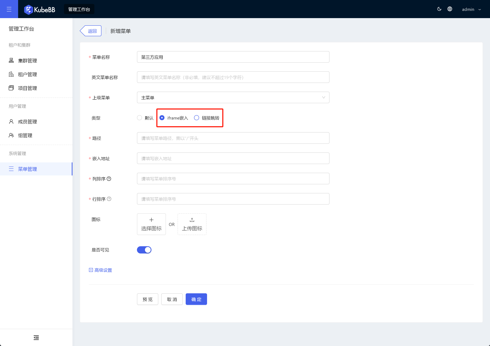

# 前端层开发

KubeBB 前端层的开发模式介绍。

## 架构概述

KubeBB 中前端层采用微前端架构，由基座应用 DockApp 及各个子应用组成，此外也支持常规应用以微前端、iframe 嵌入、菜单跳转等方式接入到 DockApp 中。

## 低码 Kit 开发的应用

低码 Kit 即云梯低码平台中开发的应用，本身就接入了微前端，可以无缝接入到 DockApp 中，用户可以在应用详情的发布管理模块中对应用进行发布，应用发布完成后会生成一个 helm 包，这个 helm 包就是一个完整的接入了微前端的 KubeBB 组件。

## 常规应用

常规应用即我们平常开发的源码应用。常规应用可以采用接入微前端、iframe 嵌入或菜单跳转的形式接入到 DockApp 中。

### 接入微前端

DockApp 采用的微前端技术方案是[乾坤](https://qiankun.umijs.org/)，常规应用需要改造成乾坤的微应用，才能接入到 DockApp 中，教程详见 [项目实践 - 微应用](https://qiankun.umijs.org/zh/guide/tutorial#%E5%BE%AE%E5%BA%94%E7%94%A8)，如果常规应用是用 Umi.js 开发的，接入微前端特别简单，支持一键启用，详见 [UmiJS - 微前端](https://umijs.org/docs/max/micro-frontend)。

推荐常规应用采用微前端的方式接入到 DockApp 中，使用体验会比较好。

### iframe 嵌入或菜单跳转

这种接入方式只需要在 KubeBB 的 “管理工作台 > 菜单管理” 中新建常用应用的对应菜单即可，类型需要选择 iframe 嵌入或链接跳转：

这种方式接入的第三方应用使用体验要比微前端接入的应用差一些。
