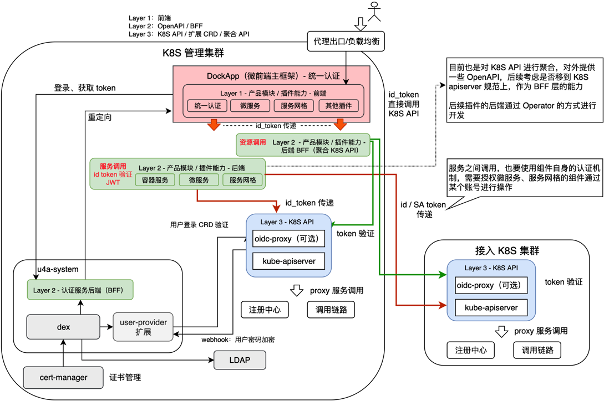

# 开发模式

KubeBB 组件的开发采取前后端分离，以 K8S 为核心的开发框架，遵循 K8S 的扩展机制及 API 规范。整体开发架构的基本逻辑如下图所示：

1. 所有组件的开发、扩展的认证都通过统一认证中心进行认证
2. 认证由微前端的主框架 DockApp 统一进行，其他微前端的扩展不需要单独支持同认证中心的处理

## 三层模式

基于低码开发的组件，将采用如下三层开发模式:

- **第一层:** 前端采用微前端架构，推荐采用低代码方式进行开发，提高代码自动化生成比例，也可采用手动开发的模式，详见 [前端层开发](./development/frontend.md)
- **第二层:** 根据业务需求增加 OpenAPI，形成统一的 BFF 层，对 API 进行聚合，提供前端所需要的业务场景数据，目前 K8s 资源的 sdk 可实现自动生成，后续这一层也会探索低码化
- **第三层:** 后端采用 CRD + controller 的 Operator 模式进行开发，形成数据驱动的流程开发模式
