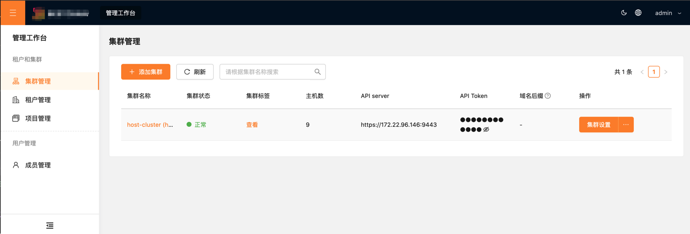

# 部署底座组件

本章节主要介绍底座组件的部署步骤，包括相关的开源技术组件、前提条件以及快速部署，并将部署的集群添加到服务门户上。

## 通过内核部署(推荐)

:::tip
安装前需完成[安装内核](./core_quickstart)。
:::

### 部署底座组件

#### 1. 创建官方组件仓库

> 可参考[使用官方组件仓库](./core_quickstart#%E4%BD%BF%E7%94%A8%E5%AE%98%E6%96%B9%E7%BB%84%E4%BB%B6%E4%BB%93%E5%BA%93)

#### 2. 创建底座组件空间

:::tip
目前仅支持使用命名空间`u4a-system`
:::

```shell
    kubectl create namespace u4a-system
```

#### 3. 部署`Cluster Component`

组件部署信息如下:

> 详细可[参考](https://github.com/kubebb/components/tree/main/examples/cluster-component)

```yaml
apiVersion: core.kubebb.k8s.com.cn/v1alpha1
kind: ComponentPlan
metadata:
  name: cluster-component
  namespace: u4a-system
spec:
  approved: true
  name: cluster-component
  version: 0.1.3
  override:
    set:
    - ingress-nginx.controller.nodeSelector.kubernetes\.io/hostname=kubebb-core-control-plane
  component:
    name: kubebb.cluster-component
    namespace: kubebb-system
```

需调整参数:

- `override.set.ingress-nginx.controller.nodeSelector.kubernetes\.io/hostname` 将作为[ingress-nginx](https://github.com/kubebb/components/tree/main/charts/cluster-component/charts/ingress-nginx)服务节点

> 此处基于[kind开发集群](./prerequisite#kind开发集群)的`kubebb-core-control-plane`节点。

`Cluster Component`部署完成后，可通过以下命令查看组件部署状态:

```shell
    kubectl get componentplan -nu4a-system cluster-component -oyaml
```

#### 4. 部署`U4A Component`

组件部署信息如下:

```yaml
apiVersion: core.kubebb.k8s.com.cn/v1alpha1
kind: ComponentPlan
metadata:
  name: u4a-component
  namespace: u4a-system
spec:
  approved: true
  name: u4a-component
  version: 0.1.3
  wait: true
  override:
    valuesFrom:
    - kind: ConfigMap
      name: u4acm
      valuesKey: "values.yaml"
  component:
    name: kubebb.u4a-component
    namespace: kubebb-system
```

其中,组件`U4A-Component`的参数通过`ConfigMap`方式注入，`ConfigMap`的创建流程可参考[U4A组件部署流程](https://github.com/kubebb/components/tree/main/examples/u4a-component#install-u4a-component)

`U4A Component`部署完成后，可通过以下命令查看组件部署状态:

```shell
    kubectl get componentplan -nu4a-system u4a-component -oyaml
```

#### 5. 访问底座服务门户

通过以下命令获取门户服务的访问地址:

```shell
(base) ➜  ~ kubectl get ingress -nu4a-system
NAME                             CLASS    HOSTS                          ADDRESS   PORTS     AGE
bff-server-ingress               <none>   portal.172.18.0.2.nip.io             80, 443   4h55m
bff-server-ingress-socket        <none>   portal.172.18.0.2.nip.io             80, 443   4h55m
kube-oidc-proxy-server-ingress   <none>   k8s.172.18.0.2.nip.io                80, 443   4h55m
```

通过浏览器访问`https://portal.172.18.0.2.nip.io`即可进入服务门户。默认的用户名密码为

- 用户名: `admin`
- 密码: `kubebb-admin`

> 注意: 由于使用了[nip.io](https://nip.io/)作为域名解析服务，因此需要将`HOSTS`中的域名解析到`ADDRESS`对应的IP地址上。

### 卸载底座组件

#### 1. 卸载`U4A Component`

```shell
    kubectl delete componentplan -nu4a-system u4a-component
```

#### 2. 卸载`Cluster Component`

```shell
    kubectl delete componentplan -nu4a-system cluster-component
```

## 通过Helm手动部署

### 部署底座组件

首先，需要部署 u4a-component 组件，负责提供基于 Kubernetes 的账号、认证、权限和审计的功能。并且，基于该组件底座，可以按照后面的步骤添加更多的功能组件。

> **注意**
> 以下步骤将部署一个 ingress nginx controller，ingressclass 名字为 'portal-ingress'，同时，部署 cert-manager 用来进行证书管理.

本步骤完成后，会部署以下服务：

- 证书管理：cert-manager
- 负载均衡：ingress-nginx
- 多租户管理：capsule
- 在没有开启 OIDC 的 Kubernetes 集群上提供 OIDC 代理：kube-oidc-proxy
- 提供 OIDC 及 IAM 服务：oidc-server
- 资源聚合服务，为对多个资源提供统一的视图资源：resource-view-controller

获取本项目的源代码后，进入 u4a-component 目录，并按照以下步骤部署：

1. 创建 namespace `u4a-namespace`

``` shell
kubectl create ns u4a-system
```

2. 编辑 u4a-component/values.yaml（helm的配置文件） 来替换以下占位符：

- `<replaced-ingress-nginx-ip>`, 替换为 ingress nginx 所部署节点的 IP

- 如果使用自己的镜像仓库，注意更新 registryServer 及其他镜像地址

3. 编辑 `charts/cluster-component/values.yaml` 文件，替换`<replaced-ingress-node-name>` 为 ingress nginx 所部署节点的名称

    ```yaml
    ingress-nginx:
    # MUST update this value
      deployedHost: &deployedHost
        <replaced-ingress-node-name>
    ```

2. 使用 helm 安装 u4a-component

    ```
    # 部署组件
    # 1. 部署 cluster-component
    $ helm install --wait -n u4a-system cluster-component -f charts/cluster-component/values.yaml charts/cluster-component
    # 等待所有的 pod 正常运行，默认 ingress-nginx 会对外暴露 80，443 端口

    # 2. 部署 u4a-component
    $ helm install --wait -n u4a-system u4a-component .
    # 等待所有的 pod 正常运行
    $ kubectl get pod -n u4a-system
    NAME                                                          READY   STATUS    RESTARTS   AGE
    bff-server-6c9b4b97f5-gqrx6                                   1/1     Running   0          45m
    capsule-controller-manager-6cf656b98c-sjm5n                   1/1     Running   0          66m
    cert-manager-756fd78bff-wb2vh                                 1/1     Running   0          76m
    cert-manager-cainjector-64685f8d48-qg69v                      1/1     Running   0          76m
    cert-manager-webhook-5c46d68c6b-f4dkh                         1/1     Running   0          76m
    cluster-component-ingress-nginx-controller-5bd67897dd-5m9n7   1/1     Running   0          76m
    kube-oidc-proxy-5f4598c77c-fzl5q                              1/1     Running   0          65m
    oidc-server-85db495594-k6pkt                                  2/2     Running   0          65m
    resource-view-controller-76d8c79cf-smkj5                      1/1     Running   0          66m
    ```

3. 在安装成功结束后，控制台会有以下提示:

    ```
    NOTES:
    1. Get the  ServiceAccount token by running these commands:

      export TOKENNAME=$(kubectl get serviceaccount/host-cluster-reader -n u4a-system -o jsonpath='{.secrets[0].name}')
      kubectl get secret $TOKENNAME -n u4a-system -o jsonpath='{.data.token}' | base64 -d
    ```

    按照提示的步骤，保存 token，会在后面添加集群的步骤中使用。

6. 此时，可以在浏览器中打开在第 2 步中配置的 ingress 地址:

    `https://portal.<replaced-ingress-nginx-ip>.nip.io`

- 注意：如果由于环境不支持自动解析 nip.io, 可以手动将域名和 ip 的映射添加到本地的 hosts 文件中. 使用默认的 admin/kubebb-admin 用户信息登录，登录后控制台如下图所示：



7. 环境准备，创建集群管理的 namespace，目前必须使用 'cluster-system'.

    ```
    kubectl create ns cluster-system
    ```

8. 在管理平台添加当前集群. 访问“管理控制台”，'集群管理'，点击 '添加集群'。

- API Host, 使用安装时配置的 `hostK8sApiWithOidc` 值

- API Token, 使用步骤 4 中保存的 token  .

现在通过服务门户，已经将当前的部署集群进行了纳管；同时，在“租户管理”中，会有一个默认的系统租户，名称为'system-tenant'.

### 卸载底座组件

  ```
  helm uninstall cluster-comoponent -n u4a-system
  helm uninstall u4a-component -n u4a-system
  kubectl delete ns u4a-system
  ```
