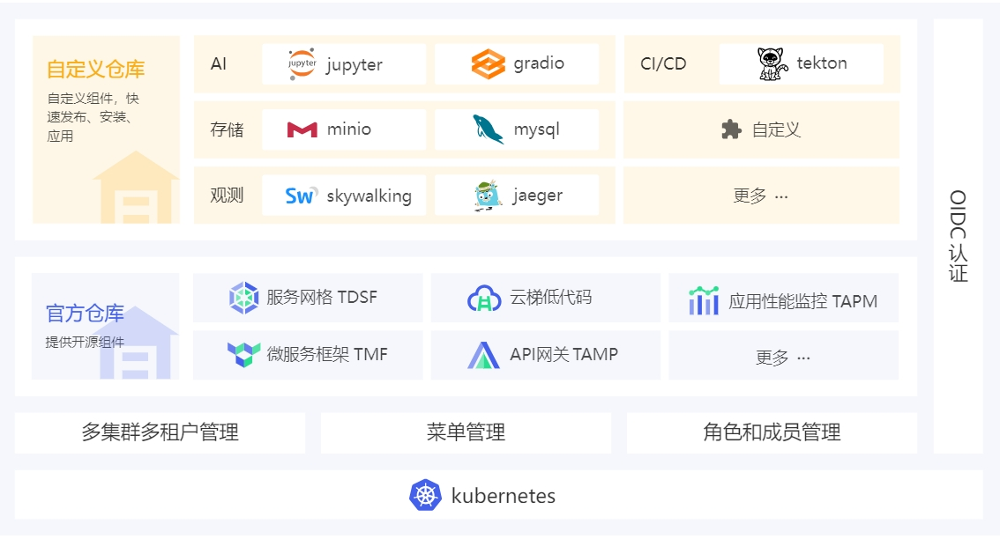

# 产品介绍

KubeBB(Kubernetes Building Blocks)是一种由内核驱动的组件生命周期管理平台，集成了开箱即用的云原生底座和低码组件开发能力。

- **提供底座服务，快速开启搭建**：提供账号、认证(OIDC)、权限(RBAC)、审计(Audit)的基础功能，采用更加标准的技术方式提供构建的底座服务
- **内核驱动的声明式组件管理**：提供声明式的组件仓库管理、组件同步、组件订阅、部署以及多维度的组件评级,完整适配 Helm 生态,集成微前端框架
- **灵活的组件开发模式**：基于微前端框架和低代码开发，定义了标准的组件封装及发布模式，让开发者可以在底座之上按照开发规范进行组件的快速开发和发布，并在统一的服务门户上对外提供服务

官方提供的组件包括微服务治理（TMF）、服务网格（TDSF）、API网关（TAMP）、应用性能监控（TAPM）的开源社区版本，详细介绍参见[**开源文档**](https://docs.tenxcloud.com/)

## 功能说明

Kubebb 部署后主要有管理工作台、组件市场两部分能力。
<table>  
    <tr>    
        <th>模块</th>  
        <th colspan="2">说明</th>
    </tr>  
    <tr><td rowspan="4" width="15%">组件市场</td>
    <td width="20%" >组件市场</td>
    <td>组件的商店，支持浏览、订阅、下载、安装组件</td>
    </tr>  
    <tr><td>组件管理</td>
    <td>1. 我发布的：支持手动发布组件到仓库；支持发布多版本  2. 我安装的：支持安装、更新、卸载组件；支持历史版本管理和版本回滚   3. 我订阅的：支持订阅、取消订阅组件；支持版本更新推送 </td>
    </tr> 
    <tr><td>组件仓库管理</td>
    <td>1. 支持添加、编辑、删除组件仓库  2. 支持配置仓库安全认证、仓库同步设置、仓库组件过滤规则、镜像仓库替换规则、开启组件评测等</td>
    </tr>  
    <tr><td>组件评测</td>
    <td>使用智能 AI 对组件从安全性、可靠性、可用性三方面进行综合评测，为您的选择提供参考数据</td>
    </tr>  
    <tr>     
        <td rowspan="6" width="15%">管理工作台</td>   
        <td width="20%" >集群管理</td>
        <td>1. 多集群统一视图管理  2. 资源管理：分内置和自定义资源，各资源支持yaml方式查看编辑  3. 集群角色和角色模板管理：集群角色支持绑定角色主体有成员、组和服务账号，均支持yaml方式查看和编辑</td>
    </tr>
    <tr><td>租户和项目管理</td>
    <td>1. 多租户、多项目统一视图管理：查看租户或项目标签、授权集群等 2. 租户授权集群，设置租户管理员 3. 项目授权集群，设置项目管理员 4. 项目内角色和成员管理、项目内服务账号管理 5. 对应资源均支持yaml方式编辑</td>
    </tr> 
    <tr><td>主体管理</td>
    <td>管理成员和组：创建、查看、删除成员；修改成员密码；创建、查看、删除组，组内加入或移出成员</td>
    </tr> 
    <tr><td>菜单管理</td>
    <td>1. 多级菜单管理，支持管理菜单名称、图标、行列排序、路径等 2. 支持默认、iframe嵌入、链接跳转三种类型的菜单样式 3. 支持设置是否可见；设置菜单的角色权限等 4. 支持使用JSON格式的菜单数据实现更多自定义菜单配置</td>
    </tr> 
    <tr><td>设置管理</td>
    <td>1. 账户中心，支持查看编辑手机、邮箱；修改密码等；支持查看所属租户项目   2. 平台信息：查看正版授权信息、更新许可证等  3. API 凭证，支持查看、下载Kubeconfig</td>
    </tr> 
    <tr><td>操作审计</td>
    <td>统一查看对资源的操作记录，支持租户、项目、集群、操作类型、状态、发起者等过滤查询</td>
    </tr> 

</table>

管理工作台用户指南详见[管理工作台](https://docs.tenxcloud.com/)

## 应用场景

### 快速搭建您的云原生平台

Kubebb 提供了多集群多租户管理、菜单管理、角色和成员管理、OIDC 认证等完善的平台基础能力。内置官方组件，通过云梯低代码组件可快速发布您的应用；通过微服务框架或服务网格统一管理和治理您的应用；通过应用性能监控统一观测服务调用，设置链路告警。同时您可发布自定义组件，例如容器服务组件，形成应用的全生命周期的管理和治理。

