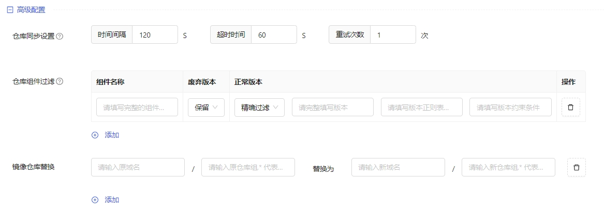

组件仓库主要用来存放管理各种组件。

## 添加组件仓库
操作步骤如下：
1. 进入[组件市场/组件仓库管理]页面，选择目标集群，点击“+组件仓库”，进入添加页面
2. 填写仓库名称、仓库地址、安全信息及高级配置
- 仓库名称：由3~253个小写字母、数字、中划线“-”或点“.”组成，并以字母、数字开头或结尾，不可重复
- 仓库地址：例http://ip(host):port，发布到仓库的组件如需在“组件市场”支持下载，此处填写地址需支持外网访问。
- 安全信息：可勾选设置https验证、安全认证，默认都不勾选
    - https验证： 上传根证书（必填）、客户端证书、客户端私钥。如需要双向认证，客户端证书和私钥也需要上传。
    - 安全认证：支持basic auth认证方式，填写认证用户名、密码
- 高级配置，可选配置
    - 仓库同步设置：对仓库中的组件进行定时数据更新。时间间隔，默认120s；超时时间，默认60s；重试次数，默认1次
    - 仓库组件过滤：
        - 默认对仓库中未添加过滤规则的组件将保留其全部版本。如需过滤某些组件的版本，可填写过滤规则。
        - 过滤规则：填写完整的组件名称；废弃版本支持选择保留、过滤；正常版本支持三种过滤方式：全部过滤、精确过滤（需完整填写、精确保留，填写完整版本
        - 对同一组件仅能设置一条过滤规则
    - 镜像仓库替换：替换规则是 原域名/原仓库组 替换为 新域名/新仓库组。可添加多条替换规则。
        
3. 仓库添加完成后，列表展示添加的仓库数据，包括组件仓库名称、URL、当前状态、最新同步时间、创建时间
    - 仓库状态：同步中、健康、异常。异常一般是仓库自身数据获取更新失败导致。异常后，可查看详细报错信息。
    - 最新同步时间：指仓库自身轮询数据的更新时间

:::info
目前仅支持系统管理员admin管理仓库
:::

## 编辑组件仓库
操作步骤如下：
1. 进入[组件市场/组件仓库管理]页面，选择目标集群，仓库列表中找到目标仓库，点击“编辑”
2. 除名称、URL之外，其他选项均可编辑。

## 删除组件仓库
操作步骤如下：
1. 进入[组件市场/组件仓库管理]页面，选择目标集群，仓库列表中找到目标仓库，点击“删除”
2. 二次弹框提示：删除组件仓库，其中组件将同步删除，请确认！